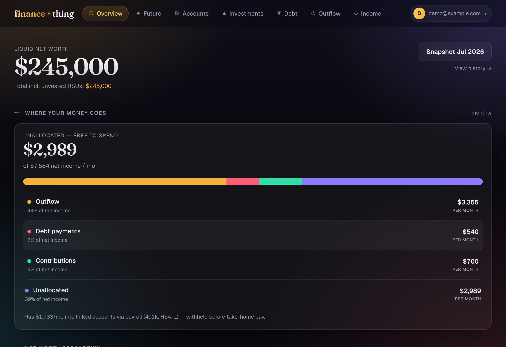
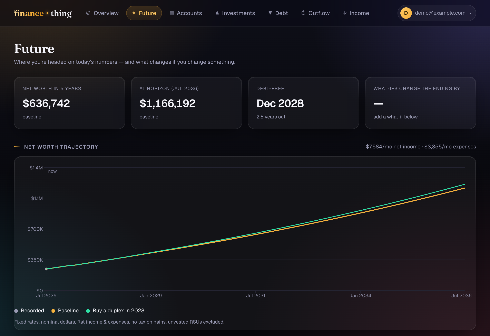
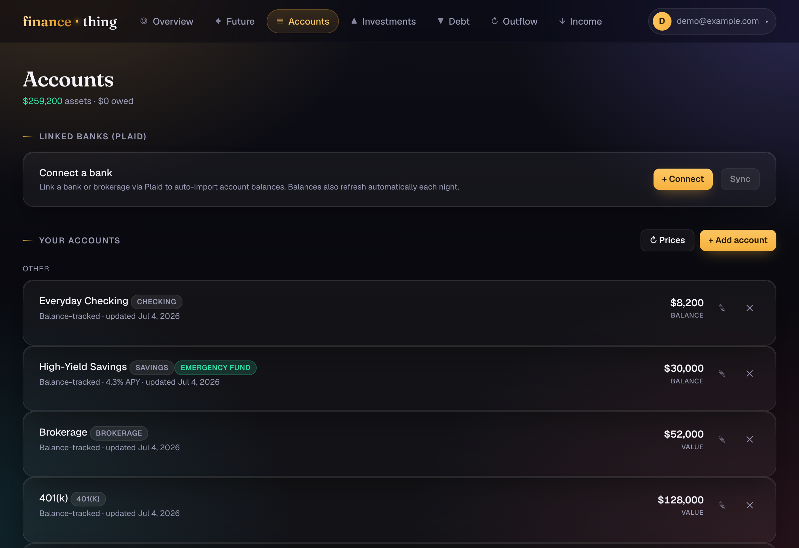
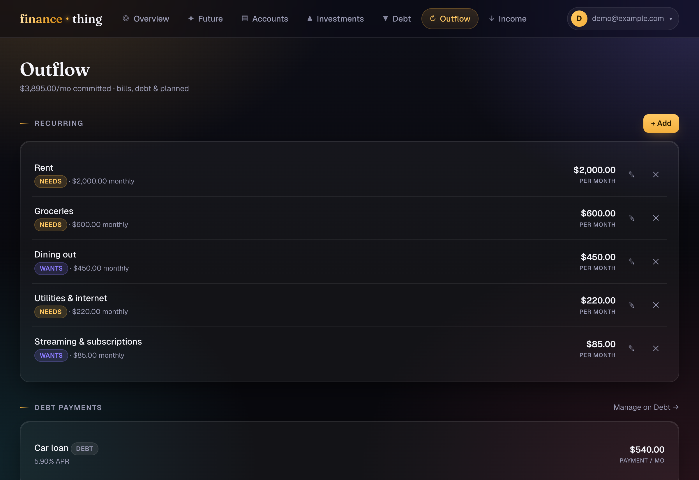

# finance-thing

[](https://github.com/genokan/finance-thing/actions/workflows/ci.yml)
[](https://github.com/genokan/finance-thing/actions/workflows/codeql.yml)

Self-hosted personal financial **planning** — not transaction bookkeeping. Model your
recurring financial picture once (income, expenses, debts, contributions), and the app
answers the questions that actually matter over years: *where does each month's paycheck
go, where am I headed, and what changes if I change something?*



## What it does

**Allocation waterfall** — every dollar of net income lands in a band: outflow, debt
payments, wealth-building contributions, or unallocated. Income runs through a real tax
engine (federal brackets + FICA + state, or a flat rate), and payroll deductions that
land in linked accounts (401k, HSA) are tracked as wealth-building too — entered once,
counted everywhere.

**Future** — a deterministic month-by-month projection of your net worth. Cash compounds
at its APY, investments at an adjustable return, debts amortize with 0%-promo handling,
and paid-off payments automatically rejoin your cash flow. Then layer on *what-ifs*: a
windfall, an extra $500/mo invested, or a financed rental property — complete with a
down payment, mortgage, and monthly cash flow. Save what-if sets as named scenarios and
overlay them on the chart. Recorded monthly snapshots plot as actuals against the
projection, so "am I on track" is a glance.



**Accounts & investments** — checking, savings (APY-aware), brokerage, retirement, HSA,
RSUs (vested/unvested tracked separately), and liability accounts. Balances sync via
Plaid (nightly, with re-auth detection and signed-webhook handling) or manual entry.
Liability accounts and their payoff terms are one record — no double entry, no double
counting.



**Outflow, budgets & debt analysis** — recurring and one-time expenses in needs/wants/
savings buckets driving a 50/30/20 view, debt opportunity-cost verdicts against your
safe benchmark rate, 0%-promo expiry alerts, and monthly net-worth snapshots recorded
automatically once each month closes.



*All screenshots show fictional demo data.*

## Stack

React 19 + Vite + TypeScript client · Express 5 + Prisma 7 API. The app ships as a
single Docker container that serves the API and the built SPA — **PostgreSQL is not
included**: the app connects to an external database you run yourself (the compose
file deliberately has no postgres service). The dark glass design system is a standalone,
token-driven stylesheet ([`client/src/ui/glass.css`](client/src/ui/glass.css)) with
zero app-specific selectors — copy the file, override the tokens, reuse it.

## Running it

### Development

```bash
npm run install:all                 # root + server + client deps
cp server/.env.example server/.env  # fill in DATABASE_URL, JWT secrets, ENCRYPTION_KEY
npm run db:push -w server           # sync the Prisma schema
npm run seed                        # create the initial admin (SEED_EMAIL / SEED_PASSWORD)
npm run dev                         # client :3000 (proxies /api) + server :3001
```

`npm run check` runs typecheck + tests across both workspaces.

### Docker

Images are published to GHCR by the Release workflow (multi-arch: amd64 + arm64):

```bash
docker pull ghcr.io/genokan/finance-thing:latest
```

```yaml
services:
  app:
    image: ghcr.io/genokan/finance-thing:latest
    restart: unless-stopped
    ports: ["3000:3000"]
    env_file: server/.env   # DATABASE_URL, JWT_*, ENCRYPTION_KEY, PLAID_*, SEED_*
```

On boot the container syncs the schema (`prisma db push`), seeds the admin user if
`SEED_EMAIL`/`SEED_PASSWORD` are set (idempotent), and starts. PostgreSQL is external —
bring your own. The container runs as a non-root user and health-checks
`/api/health` (which also verifies the database connection).

## Security posture

- **CI validates, releases publish.** Every push runs gitleaks (full history),
  typecheck + tests with coverage, an image build, and a Trivy scan that fails on
  fixable CRITICAL/HIGH vulnerabilities. Nothing is pushed to a registry from CI —
  publishing happens only when a GitHub release is created.
- **CodeQL** (`security-extended`) on every push/PR and weekly.
- **Scan results are public:** Trivy SARIF feeds the repo's
  [Security tab](https://github.com/genokan/finance-thing/security/code-scanning), and each
  GitHub release ships the full human-readable scan report as an asset.
- **Dependabot** for npm, GitHub Actions, and the base image; all workflow actions
  are pinned to full commit SHAs.
- Plaid access tokens are AES-256-GCM encrypted at rest; Plaid webhooks are verified
  against Plaid's ES256 signature; refresh tokens are revocable server-side
  (password changes invalidate all other sessions).
